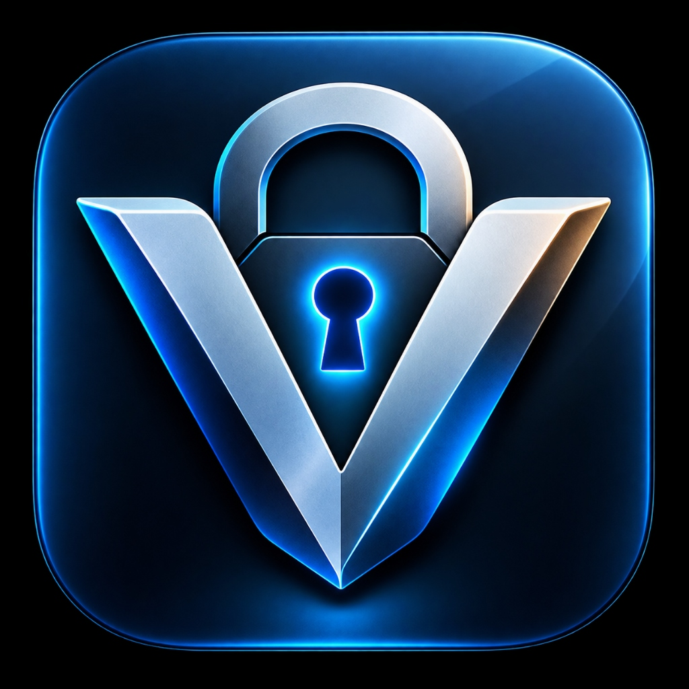

<p align="center">
  
</p>

<h1 align="center">Veylock</h1>

<p align="center">
  <strong>Your personal vault for passwords, credentials, codes, cards, and private notes.</strong><br>
  Local-first. Encrypted. Designed to stay under your control.
</p>

<p align="center">
  <a href="https://github.com/RoyalRohan/veylock/releases">Releases</a> ·
  <a href="https://github.com/RoyalRohan/veylock/issues">Issues</a> ·
  <a href="https://github.com/RoyalRohan/veylock/blob/main/SECURITY.md">Security</a>
</p>

---

## What Veylock is

Veylock is a local-first password and credential manager built around one simple idea: your vault should belong to you.

The application stores vault data locally, uses authenticated encryption for sensitive payloads, does not require a Veylock account, and is designed to work without a cloud service. The project is built with Tauri 2, Rust, React, TypeScript, SQLite, and Tailwind CSS.

Veylock supports purpose-built records for logins, secure notes, authenticators, payment cards, software licenses, servers, and API credentials. Each type has its own editor and presentation rather than forcing unrelated data into one generic form.

## Highlights

- **Local-first vault** — credentials stay on the device unless you explicitly export a backup.
- **Encrypted storage** — sensitive entry payloads are protected with AES-256-GCM.
- **Password-based key protection** — Argon2id is used to derive the key that unwraps the vault encryption key.
- **Secure clipboard handling** — copied secrets can be cleared automatically.
- **Built-in authenticator** — offline RFC 6238 TOTP generation with configurable parameters.
- **Password generator** — cryptographically secure password and passphrase generation.
- **Security health** — identify weak, reused, or missing-2FA credentials.
- **Encrypted `.vlock` backups** — portable vault backups intended for user-controlled storage.
- **Custom fields and tags** — keep extra credentials and metadata organized.
- **Dark, Light, and System themes** — with a restrained, security-focused visual design.
- **Desktop and Android builds** — with macOS support through the same Tauri project.

## Vault item types

| Type | Intended for | Examples |
|---|---|---|
| **Logins** | Website and application accounts | Username, password, URL, optional TOTP |
| **Secure Notes** | Private text and recovery information | Recovery codes, confidential notes |
| **Authenticators** | Standalone 2FA secrets | TOTP secret, issuer, account |
| **Payment Cards** | Card credentials | Card number, expiry, CVV, billing address |
| **Software Licenses** | Product licenses | License key, publisher, version, dates |
| **Servers & SSH** | Infrastructure credentials | Host, port, protocol, username, SSH key |
| **API Credentials** | Developer/service secrets | Endpoint, API key, token, client credentials |

## Download an official release

Official builds are published on GitHub:

**[Download Veylock Releases →](https://github.com/RoyalRohan/veylock/releases)**

Open the newest release and download the artifact for your platform. Use the package that matches your operating system and CPU architecture.

### Windows

Download the Windows installer from the release assets. Depending on the release, this may be an `.exe` installer or an `.msi` package.

### Fedora / RHEL-based Linux

Download the **x86_64 `.rpm`** package from the release assets, then install it with:

```bash
cd ~/Downloads
sudo dnf install ./veylock-<version>-1.x86_64.rpm
```

For example:

```bash
sudo dnf install ./veylock-1.1.0-1.x86_64.rpm
```

### Ubuntu / Debian-based Linux

Download the `.deb` package and install it with:

```bash
cd ~/Downloads
sudo apt install ./veylock-<version>-amd64.deb
```

### Linux AppImage

Download the `.AppImage`, make it executable, and run it:

```bash
chmod +x Veylock*.AppImage
./Veylock*.AppImage
```

### Android

Download the Android `.apk` from the release assets and install it on your device. Android may require permission to install applications from the browser or file manager you used to download the APK.

### macOS

Veylock is built with Tauri and the project supports macOS as a build target. When a macOS installer is published, download the release's **`.dmg`** artifact for your Mac (Apple Silicon or Intel, as labeled by the release) and install it normally.

If a macOS installer is not present in a particular release, use the source-build instructions below to build Veylock locally on a supported Mac.

## Backups

Veylock backups use the `.vlock` format and contain encrypted vault data. Keep backups somewhere you control, such as an external drive or a trusted storage provider.

A backup should not live only inside Veylock's application data directory. For a portable backup, export it to a user-selected location and keep at least one additional copy somewhere separate from the device running Veylock.

## Build from source

### Prerequisites

- Node.js 20+
- npm
- Rust and Cargo 1.75+
- Tauri prerequisites for your operating system

### Clone

```bash
git clone https://github.com/RoyalRohan/veylock.git
cd veylock
```

### Install dependencies

```bash
npm install
```

### Run the frontend

```bash
npm run dev
```

### Run the native desktop application

```bash
npm run tauri dev
```

### Verify the project

```bash
npx tsc --noEmit
npm run build
cd src-tauri && cargo test
```

### Build production bundles

```bash
npm run tauri build
```

The exact bundle formats depend on the host platform and the Tauri configuration. Published release assets are the easiest option for most users.

## Architecture and security

Veylock uses a Tauri 2 frontend/backend boundary with Rust handling vault operations, cryptography, SQLite persistence, clipboard protection, TOTP generation, and backup import/export. The current data model keeps item-specific fields optional to preserve compatibility with existing vaults and backups. fileciteturn0file0L7-L20 fileciteturn0file0L96-L176

The documented cryptographic design uses Argon2id to derive a key-encryption key and AES-256-GCM to protect vault item payloads; active key material is intended to be zeroized when the vault is locked. fileciteturn0file0L43-L69

Read the project security documents before relying on Veylock for sensitive use cases:

- [ARCHITECTURE.md](./ARCHITECTURE.md)
- [SECURITY.md](./SECURITY.md)
- [THREAT_MODEL.md](./THREAT_MODEL.md)
- [PRIVACY.md](./PRIVACY.md)

## Privacy

Veylock does not require a Veylock account, subscription, or registration. The project is designed for local storage and does not require a central Veylock server for normal vault operations. fileciteturn0file3L22-L41

See [PRIVACY.md](./PRIVACY.md) for the project's current privacy commitments and boundaries.

## Contributing

Contributions are welcome when they improve reliability, usability, accessibility, or security. Please read [CONTRIBUTING.md](./CONTRIBUTING.md) before opening a pull request.

Security-sensitive changes should receive careful review and must not introduce plaintext secret handling or unnecessary network dependencies. fileciteturn0file2L7-L20

## Reporting a security issue

Please do not publish an unverified security vulnerability in a public GitHub issue. Follow the private reporting process in [SECURITY.md](./SECURITY.md).

## Project status

Veylock is an actively developed personal/open project. Treat releases as the authoritative source for downloadable application builds, and read the release notes for platform-specific changes.

## License and source availability

Veylock is **source-available software**, not an OSI-certified open-source project. The source is published so it can be inspected, studied, and contributed to, while distribution of modified or unofficial builds is reserved to the project owner unless separately authorized.

See [LICENSE](./LICENSE) for the full terms.

## Author

**Rohan Ghimire**

- GitHub: https://github.com/RoyalRohan
- Project: https://github.com/RoyalRohan/veylock
